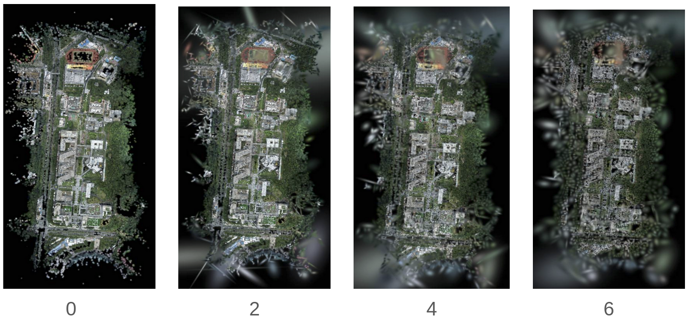

# Hierachical Gaussian

## 1. Motivation and Problem Definition
- We want to have further understanding of current 3D representation
- Visual Place Recognition is a good start
- The definition would be the following: 
Input: 3D Representation and one or multiple 2D images
Output: Location in 3D representation, where those 2D images been taken


## 2. Preliminaries
- One need to have per Gaussian Features
- One can follow our pipeline here or do one's own
- We recommend to follow: https://splat-distiller.pages.dev/ to add your Gaussian Features. But we essentially just need a N,C tensor, where N is the number of Gaussian, and C is the number of channels

## 3. Instruction
### 3.1. Installation
- First Install Splat Feature Solver
- Then run:
```
pip install .
```

### 3.2 Train Gaussian: 
- Follow gsplat, train one's own Gaussian 

### 3.3 Lifting (Currently only support JAFAR hight dimensional dinov3 model)
```
python distill_wrapper.py -data.dir ${ur data dir contain colmap info} --distill.ckpt {trained Gaussian CKPT} --model.model-path {high dimensional dinov3 model pth}
```

### 3.4 Constructing Hierachical GS
```
python construct_hierachical_gs -c {ckpt path} -f {feature location} -o {output path}
```

### 3.5 Visualization
```
python hierachical_viewer.py -s {the output GS}
```

## 4. Stage I Results
### 4.1 Initial Gaussian and Initial Features
 The left handside is the initial 3DGS trained using the gsplat pipeline, and the right handside is the lifted features using Splat Feature Solver. The lifted features is JAFAR DINOV3 

### 4.2 Spatial Tree Construction
 Here is the reconstructed node that partition the Gaussian Splats into smaller and smaller region


### 4.3 Splate Moment Matching
 Here is the 3DGS moment matching. That is to say, for each higher level Gaussian, how we construct the Gaussian

### 4.4 Patchify Image Construction
 Here, we construct a patchified image feature to have cross attention with Gaussian Splats

### 4.5 Pipeline Output
 From Quantitative Result, we can see dramatically improvement


## TO DO
- [x] For Lifted Gaussian, according to the PCA-TREE establish merge procedure and establish a hierachical feature
- [x] Establish Hierachical Gaussian Loader, and Gaussian Viewer using gsplat_ext
- [x] Establish the Gradio Visualization Tab for Image Features and blending with gsplat_ext
- [x] Establish the node traversing visualization
- [x] Establishing a universal Query System that can fit into viewer and can pipelining
- [x] Establish 3D Node Features and 2D Patchify Image Feature Cross Attention Mechanism
- [x] Experiments and Explaination Visually

## Stage II To Do
- [x] Generalize the rough visual localization pipeline
- [x] Establishing the Ground Truth visualization tool
- [x] Establishing the Metrics Measurement Pipeline
- [ ] Establish the Pipeline for train, lifting, hierachical decomposite, eval
- [ ] Verify the Metrics is Reliable
- [ ] Establishing the Detail Debugging Components 


